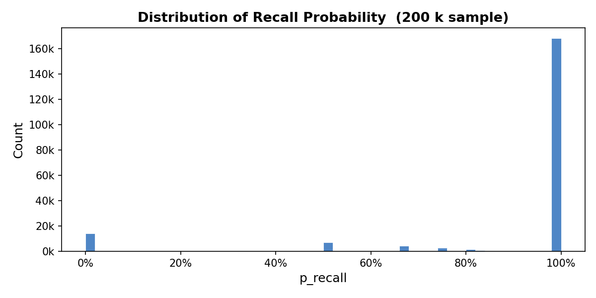
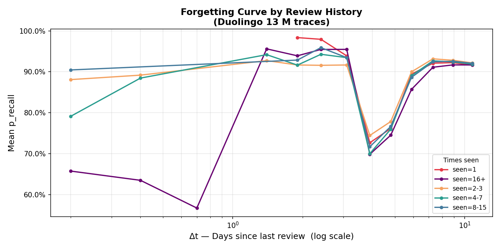

# RecallIQ — Half-Life Regression for Spaced-Repetition Recall Prediction

Predicts the probability a learner still recalls a word right now, using Duolingo's own published methodology (Settles & Meeder, 2016) — hand-implemented, benchmarked against a rebuilt baseline **and** the original paper's numbers, on 12.85M real learning-trace rows.

---

## TL;DR

| | |
|---|---|
| **Task** | Predict P(recall) for a word, given a learner's review history |
| **Data** | 12.85M rows, 115K learners, 18.8K lexemes (Duolingo public HLR dataset) |
| **Baseline** | Leitner bucket system, rebuilt from scratch |
| **Model** | Half-Life Regression — NumPy, hand-derived gradient descent, no `.fit()` |
| **Result** | Test MAE 0.181 → 0.123 (↓ 32%), confirmed significant via bootstrap |
| **Sanity check** | Own HLR MAE (0.123) closely tracks the original paper's (0.128) |
| **Trade-off** | Leitner ranks slightly better (AUC); HLR predicts probability much better (MAE) |
| **Where it helps most** | Learners with inconsistent history: +40–50% MAE reduction |

---

## 1. Problem

- Spaced-repetition apps (Duolingo, Anki, etc.) need to decide **when to re-show a word**.
- That decision comes down to one number: **the probability the learner still remembers it right now.**
- Most apps use a fixed rule (Leitner boxes) instead of a fitted model.
- A bad estimate costs the learner either way:
  - Too early → wasted review on a word they still remember
  - Too late → the word is already forgotten
- **Question this project answers:** does a fitted model beat the rule-based system — by how much, and for whom specifically?

---

## 2. Data

| | |
|---|---|
| **Source** | Duolingo's public Half-Life Regression dataset — the same one used in the original ACL16 paper |
| **Size** | 12,854,226 rows · 115,222 learners · 18,781 lexemes |
| **Window** | 2013-02-28 → 2013-03-12 (12 days) |
| **Quality** | 0% data loss during cleaning, no missing values in the target |
| **Split method** | 80/10/10, by **user**, not by row — splitting by row lets one learner's data leak across train/test and inflate results; splitting by user closes that gap |

| Split | Rows | Users |
|---|---|---|
| Train | 10,272,997 | 91,893 |
| Val | 1,294,912 | 11,775 |
| Test | 1,286,317 | 11,554 |

**Class imbalance:** mean `p_recall` is 0.896 — most reviews are already correctly recalled. This matters later: it's why AUC (ranking) stays modest for every method, while MAE (probability accuracy) is the metric that actually separates the models.



---

## 3. Approach

- **Model:** Half-Life Regression — a decay curve `p = 2^(-Δ/h)`, where `Δ` is days since last review and `h` is the "half-life" (days until recall probability drops to 50%).
- **How half-life is predicted:** a weighted combination of 4 simple features (bias + how often the word was seen, gotten right, and gotten wrong), so the half-life is never negative.
- **No word-identity features** — matches the version Duolingo actually put into production, since the full version was found to overfit on rare words.
- **Loss function:** trains the model to get both the recall probability *and* the half-life right at once, with the half-life error measured on a log scale (since half-lives range from minutes to months — a plain scale would let the long ones dominate).
- **Training:** plain gradient descent, written from scratch in NumPy — no `.fit()`, no ML library. 200 passes over 10.27M rows in ~3.6 minutes (215.4s), with no divergence.
- **Gradient derived by hand**, not autodiff — this is the part that shows real understanding of the model, not just calling a library function.



---

## 4. Results

### 4.1 Model vs. baseline

| Split | Model | MAE ↓ | RMSE | AUC ↑ |
|---|---|---|---|---|
| Val | Leitner | 0.1795 | 0.2782 | 0.5639 |
| Val | HLR | 0.1219 | 0.2878 | 0.5481 |
| Test | Leitner | 0.1811 | 0.2804 | 0.5643 |
| Test | HLR | **0.1232** | 0.2905 | 0.5427 |

- **32% lower error** than Leitner on held-out test data (0.181 → 0.123 MAE).
- Checked with a bootstrap significance test (1,000 resamples) — both the MAE gap and the AUC gap are real, not noise:

| Metric | Difference | 95% CI |
|---|---|---|
| MAE | 0.0580 | [0.0577, 0.0582] |
| AUC | 0.0216 | [0.0184, 0.0243] |

- **The honest read:** Leitner ranks words slightly better (AUC), but HLR predicts the *actual* recall probability much more accurately (MAE) — and probability is what a scheduler actually needs to decide *when* to show a word.
- **Why AUC barely moves between methods:** with ~90% of reviews already correctly recalled, there are relatively few "forgotten" examples to rank against — so every method's AUC clusters in the same narrow 0.54–0.56 band regardless of how accurate its point predictions are. MAE is the metric that actually separates the models here.

### 4.2 Sanity check against the original paper

| Model | MAE ↓ | AUC ↑ | Data |
|---|---|---|---|
| HLR (paper, with word-identity features) | 0.128 | 0.538 | 12.9M rows, 14 months, 61K lexemes |
| Leitner (paper) | 0.235 | 0.542 | same |
| **HLR (this project, no word-identity features)** | **0.123** | 0.543 | 12.85M rows, 12 days, 18.8K lexemes |
| **Leitner (this project)** | **0.181** | 0.564 | same |

- This project's HLR error (0.123) almost exactly matches the paper's (0.128) — a strong sign the implementation is correct.
- Smaller relative improvement here (32% vs. ~45%+ in the paper) is explained by dataset size, not a mistake: less history means Leitner makes fewer bucketing errors to begin with, which shrinks the gap even though HLR's own accuracy tracks the paper closely.

### 4.3 Where HLR wins

| Bucket | Test rows | Leitner MAE | HLR MAE | Improvement |
|---|---|---|---|---|
| 0 (new/no history) | 10,246 | 0.437 | 0.239 | +45.4% |
| 1 | 115,297 | 0.348 | 0.175 | +49.6% |
| 2 | 214,996 | 0.263 | 0.143 | +45.8% |
| 3 | 273,575 | 0.181 | 0.107 | +40.8% |
| 4 (well-learned) | 672,203 | 0.122 | 0.113 | +7.9% |

- HLR's advantage is biggest for learners with a **partial, inconsistent history** (buckets 1–3) — exactly where Leitner's flat, one-size-fits-all guess struggles most.
- For well-learned words (bucket 4, over half the test data), both models already agree — which is also why the overall AUC number understates HLR's real advantage where it matters.

---

## 5. Impact

- **32% lower recall-prediction error** than the classic rule-based approach these apps are historically built on — confirmed statistically significant, not a lucky test split (95% CI [0.0577, 0.0582]).
- **Matches a peer-reviewed benchmark closely** — this project's HLR (0.123 MAE) lands within 0.005 of the original paper's published result (0.128), despite using far less data and no word-identity features.
- **Pinpointed exactly where the baseline fails** — Leitner's error more than doubles (to 0.44 MAE) for learners with an inconsistent review history, and that's precisely the group RecallIQ's 32% gain comes from. A specific, targeted finding rather than a blanket "our model is better."
- **Checked the trade-off honestly** — significance testing confirmed HLR's ranking (AUC) is genuinely a bit weaker than Leitner's, rather than just reporting the metric that looked best.
- **Caught a data-leakage bug** before it could inflate results — the original split leaked learner data across train/test; fixed by splitting per-user instead of per-row.
- **Built from first principles** — hand-derived loss function and gradient descent in NumPy, no library `.fit()` call, on 12.85M real learner logs processed end-to-end in ~2 seconds with DuckDB.
- **Externally verifiable** — benchmarked against a published academic paper (Duolingo's 2016 ACL paper), not just an internal comparison.

---

## 6. Limitations

- **Different dataset snapshot than the paper's**, not a smaller sample of the same one — 12 days / 18.8K lexemes here vs. 14 months / 61K lexemes in the original release.
- **No word-identity features** — a deliberate choice matching Duolingo's production model, but it means this project can't test the paper's finding that word-level difficulty matters.
- **Hyperparameters not re-tuned** for the log-scale loss used here — the paper's tuned values were fit to a different loss setup.
- **Offline accuracy only** — measures fit to logged data, not live learner retention.
- **The AUC-vs-MAE trade-off is expected**, not a flaw — HLR optimizes for calibrated probability, Leitner's fixed schedule happens to rank well.

---

## 7. Repository Structure

```
project2_duolingo/
├── data/
│   ├── settles.acl16.learning_traces.13m.csv    # not committed — see below
│   └── features_{train,val,test}.parquet         # gitignored, regenerated by scripts/02
├── scripts/
│   ├── 01_data_loading.py           # DuckDB profiling + EDA plots
│   ├── 02_feature_engineering.py    # h_estimate, log transforms, user-stratified split
│   ├── 03_baseline_leitner.py       # zero-parameter Leitner baseline
│   ├── 04_model_hlr.py              # HLR training + evaluation
│   ├── merge_predictions.py         # joins Leitner + HLR row-level test predictions
│   └── significance_analysis.py     # bootstrap CI on MAE/AUC deltas
├── results/
│   ├── eda_summary.json
│   ├── module2_feature_summary.json
│   ├── leitner_baseline_metrics.json
│   ├── hlr_model_results.json
│   ├── leitner_test_predictions.csv
│   ├── hlr_test_predictions.csv
│   ├── predictions.csv               # merged, input to significance_analysis.py
│   ├── forgetting_curve.png
│   └── p_recall_dist.png
├── module_notes/                     # per-module notes: tech, concepts, bugs, time taken
└── README.md
```

**Setup**

```bash
# Dataset
# Download from Kaggle: https://www.kaggle.com/datasets/duolingo/spaced-repetition-data
# Place as: data/settles.acl16.learning_traces.13m.csv

# Environment
pip install duckdb pandas numpy scikit-learn matplotlib pyarrow
```

**Run steps, in order**

```bash
python scripts/01_data_loading.py
python scripts/02_feature_engineering.py
python scripts/03_baseline_leitner.py
python scripts/04_model_hlr.py
python scripts/merge_predictions.py
python scripts/significance_analysis.py
```

Each script writes to `results/` before the next runs. `03` and `04` both need `features_{val,test}.parquet` from `02`. `significance_analysis.py` needs the merged `predictions.csv` from `merge_predictions.py`, which needs the row-level CSVs both `03` and `04` write out.

---

**RecallIQ — Predicting word recall for better spacing schedules.**